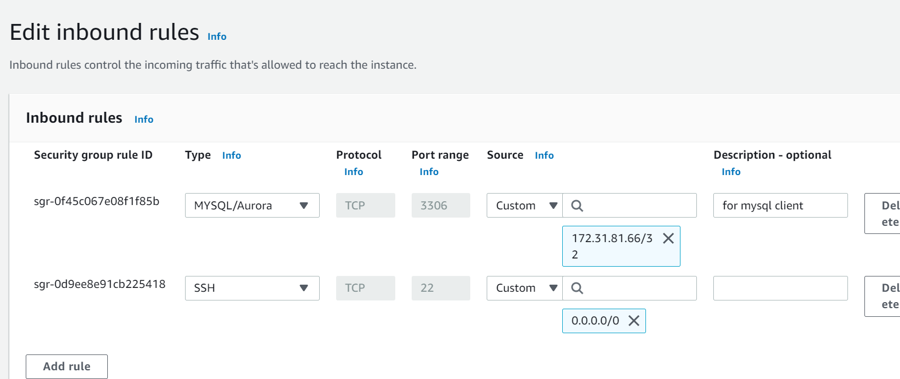

## IMPLEMENT A CLIENT SERVER ARCHITECTURE USING MYSQL DATABASE MANAGEMENT SYSTEM (DBMS).
---
1. ### **Create and configure two Linux-based virtual servers (EC2 instances in AWS).**
Server A name - `mysql server`

Server B name - `mysql client`


1. On mysql server Linux Server install `MySQL Server software`.
   
   ```
   sudo apt update
   sudo apt upgrade
   sudo apt install mysql-server
   ```
   sudo systemctl status mysql

   

sudo mysql_secure_installation

sudo systemctl enable mysql

**create a new user:**

sudo mysql

mysql> `CREATE USER 'billy'@'%' IDENTIFIED WITH mysql_native_password BY 'Password1';`


**Create a Database and Grant permitions**

mysql> `CREATE DATABASE test_db;`

mysql> `GRANT ALL ON test_db.* TO 'billy'@'%' WITH GRANT OPTION;`


**To reload Grant table:**

mysql> `FLUSH PRIVILEGES;`

2. On mysql client Linux Server install `MySQL Client software`.

```
   sudo apt update
   sudo apt upgrade
   sudo apt install mysql-client
   ```
   **check the version of mysql-client**
   
   `mysql -V` 
   
   "Notice it is a captal V"

   


### **3. Configure MySQL server to allow connections from remote hosts.**


`sudo vi /etc/mysql/mysql.conf.d/mysqld.cnf`

Replace ‘127.0.0.1’ to ‘0.0.0.0’ like this:


### **4. Configur the mysql-server security group**

MySQL server uses `TCP port 3306` by default`, so we will have to open it by creating a new entry in ‘Inbound rules’ in ‘mysql server’ Security Groups

- Open port 3306 and limite access only to client ip




### **5. Connect to mysql server from from mysql client**

Use `mysql server's local IP address to connect` from mysql client.

Syntax:

`sudo mysql -u username -h mysql_server_ip -p`


$ `mysql -u billy -h 172.31.84.84 -p`


 
### **6. Test:**

mysql> `Show databases;`


